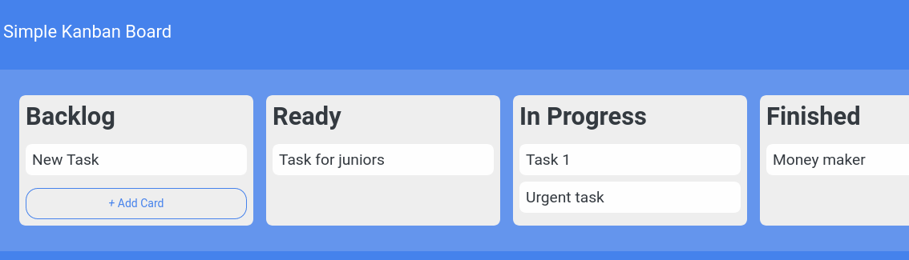
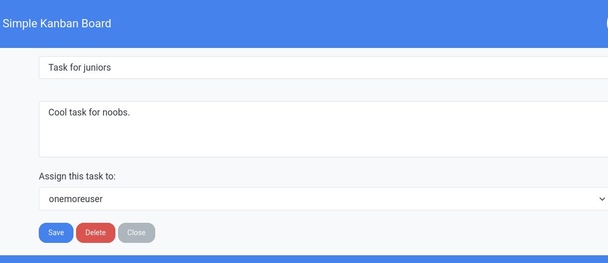
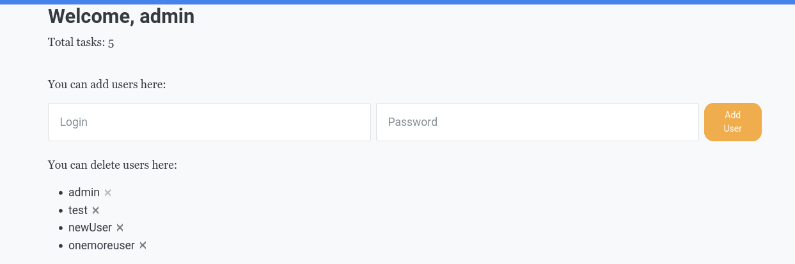
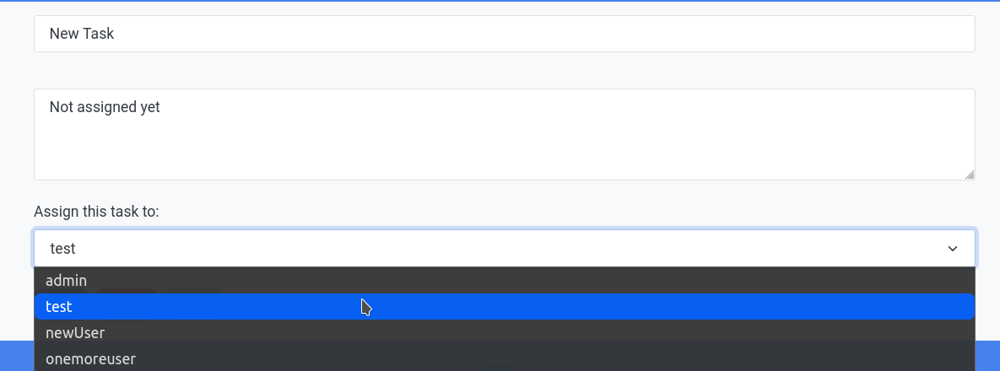

# Модуль 20. Таск-менеджер

## 20.4 Практическое задание

## Содержание

[1. Что необходимо сделать](readme.md#Задание)

[2. Основные задачи](readme.md#Основные-задачи)

[3. Требования к верстке и CSS](readme.md#Требования-к-верстке-и-CSS)

[4. Задание 1](readme.md#Задание-1)

[5. Задание 2](readme.md#Задание-2)

[6. Задание 3](readme.md#Задание-3)

[7. Screenshots](readme.md#Screenshots)

## Задание

Разработать приложение «Task-менеджер».

**Что необходимо сделать?**

1. Скачать из репозитория [по ссылке](https://github.com/ledvanoff/sf_oopapp) каркас кода.

2. Если пользователь ввел неправильные данные или не зарегистрирован в приложении, то вывести в виде всплывающего окна (alert) сообщение о том, что доступ запрещен.

3. При удачном входе пользователя, необходимо вывести кнопку «_Sign Out_» и вывести приветственное сообщение в верхней панели, например «**Здравствуйте, admin**».

4. Необходимо создать таблицу (канбан доска) конкретного пользователя, где будут отображаться его задачи. Пример на картинке, а также макет можно увидеть [здесь](https://www.figma.com/file/yotdhAHetNQZy1tOi1UTPk/Kanban?node-id=1%3A).

5. Задачи (_TODO_ тикеты) должны быть привязаны к конкретному пользователю и должны быть видны только ему с возможностью их редактирования (см. п.6). Исключением является администратор, он видит задачи всех пользователей и кому они предназначаются, а также он может их удалять и редактировать.

6. Задачи (_TODO_ тикеты) можно менять и редактировать, перетаскивать из колонки в колонку, а также удалять. Данный пункт можно выполнить с помощью функции `drag&drop`. Если не получается, то можно сделать оформление в виде формы с выпадающим списком и при выборе, отправлять тикет в нужную колонку.

7. Администратор может добавлять и удалять пользователей.

:arrow_up: [к содержанию](readme.md#Содержание)

## Основные задачи

1. Развернуть приложение с использованием webpack.
2. Следуя правилам компонентного подхода, разбить kanban board на смысловые блоки, сверстать.
3. Реализовать некоторый функционал, который описан в ведении в блоке «Постановка задачи»

[Макет здесь.](https://www.figma.com/file/yotdhAHetNQZy1tOi1UTPk/Kanban?node-id=1%3A2)

:arrow_up: [к содержанию](readme.md#Содержание)

## Требования к верстке и CSS

1. Соблюдайте семантическую вёрстку. Кнопка должна быть `button`, элементы дропдауна списком и так далее.
2. Учитывайте состояния кнопки «`+ Add card`» — `active` и `disable`.

   - Если кнопка активна, при наведении должна подсвечиваться, курсор меняться на `pointer`;
   - Если кнопка задизейблена (неактивна), её цвет должен отличаться от обычного состояния, при наведении курсор не меняется, `hover` не применяется;
   - В обычном состоянии кнопка должна соответствовать макету либо задуманному вами дизайну.

3. При выборе списка задач из дропдауна (наведении, клике) применяйте эффекты, например, выделять цветом, менять курсор на pointer.
4. Использовать селекторы по тегу для задания стилей нельзя, используйте классы.

:arrow_up: [к содержанию](readme.md#Содержание)

## Задание 1

### Добавление новой задачи в список

> Исходная Канбан-доска должна иметь 4 блока задач:

1. _Backlog_ (задачи, которые требуют уточнения перед тем, как брать их в работу);
2. _Ready_ (задачи, которые могут быть взяты в работу);
3. _In progress_ (задачи, которые уже в работе);
4. _Finished_ (законченные задачи).

> Либо 3 блока задач:

1. _Ready_ (задачи, которые могут быть взяты в работу);
2. _In progress_ (задачи, которые уже в работе);
3. _Finished_ (законченные задачи).

**_Это на Ваше усмотрение и пожелания._**

> ### _Алгоритм работы на 4 блока:_

1. Первоначально задача размещается в бэклоге — для анализа. При клике на кнопку «`+ Add card`» должно появляться новое поле в конце списка, между последней задачей и кнопкой, для которого реализована возможность ввода. При этом кнопка «`+ Add card`» должна меняться на «Submit» Созданные задачи должны сохраняться в `localStorage`. Нажали кнопку — появилось поле для редактирования — ввели название — нажали кнопку «`Submit`» или ушли с поля (расфокусировались, кликнули и так далее) — название сохранилось — задача появилась в бэклоге.
2. Задачи для списка _Ready_ берутся из _Backlog_. При клике на «`+ Add card`» в этом списке, должна быть предоставлена возможность выбора задач _Backlog_ из дропдауна. При клике на кнопку в конце списка, между последней задачей и кнопкой появляется дропдаун с возможными вариантами. После клика на задачу из дропдауна, она должна появиться в списке последней.
3. Задачи для списка _In progress_ берутся из _Ready_. Реализация, аналогичная п.2.
4. Задачи для списка _Finished_ берутся из _In progress_. Реализация, аналогичная п.2.
5. Если задач в списках _Backlog_, _In progress_, _Ready_ — нет, кнопку нужно задизейблить (убрать возможность клика).

6. Когда задача попадает в следующий список, из текущего её нужно удалить. Например, когда в список _Ready_ попадает задача из _Backlog_, из _Backlog_ она должна быть удалена. По аналогии должно быть реализовано и для других списков.
7. Добавить вывод активных и завершенных задач в футер. _Active tasks_ — количество задач из Бэклога. _Finished_ tasks — количество задач из списка _Finished_.

> ### _Алгоритм работы на 3 блока:_

1. Первоначально задача размещается в _Ready_ для анализа. При клике на кнопку «`+ Add card`» должно появляться новое поле в конце списка, между последней задачей и кнопкой, для которого реализована возможность ввода. При этом кнопка «`+ Add card`» должна меняться на «`Submit`» Созданные задачи должны сохраняться в `localStorage`. Нажали кнопку — появилось поле для редактирования — ввели название — нажали кнопку «`Submit`» или ушли с поля (расфокусировались, кликнули и так далее) — название сохранилось — задача появилась в _Ready_ .
2. Задачи для списка _In progress_ берутся из _Ready_. При клике на «`+ Add card`» в этом списке, должна быть предоставлена возможность выбора задач из _Ready_ из дропдауна. При клике на кнопку в конце списка, между последней задачей и кнопкой появляется дропдаун с возможными вариантами. После клика на задачу из дропдауна, она должна появиться в списке последней.
3. Задачи для списка _Finished_ берутся из _In progress_. Реализация, аналогичная п.2.
4. Если задач в списках _In progress_, _Ready_ — нет, кнопку нужно задизейблить (убрать возможность клика).
5. Когда задача попадает в следующий список, из текущего её нужно удалить. Например, когда в список _In progress_ попадает задача из _Ready_, из _Ready_ она должна быть удалена. По аналогии должно быть реализовано и для других списков.
6. Добавить вывод активных и завершенных задач в футер. _Active tasks_ — количество задач из _Ready_. _Finished tasks_ — количество задач из списка _Finished_.

:arrow_up: [к содержанию](readme.md#Содержание)

## Задание 2

### Добавление user menu

Реализуйте выпадающий список, который будет появляться при клике на блок в правом верхнем углу — контейнер с аватаром пользователя и стрелочкой.

Дизайн вы можете найти по ссылке в начале документа.

- Содержание — произвольное, пример — _My account_, _My tasks_, _Log out_;
  Необходимо придерживаться стилей, которые используются в макете, а именно — цветовая гамма, шрифты, отступы;
- Стрелочка рядом с аватаром должна смотреть вверх, когда меню открыто, и вниз (как на макете), когда меню закрыто.

Добавить выделение пунктов меню (например, _hover_, _cursor_).

:arrow_up: [к содержанию](readme.md#Содержание)

## Задание 3

### Реализация пользователей

Реализуйте роли для пользователей администратор и обычного пользователя канбан доски, а также их прав доступа в соответствии блока «Постановка задачи».

:arrow_up: [к содержанию](readme.md#Содержание)

## Screenshots

:arrow_up: [к содержанию](readme.md#Содержание)
